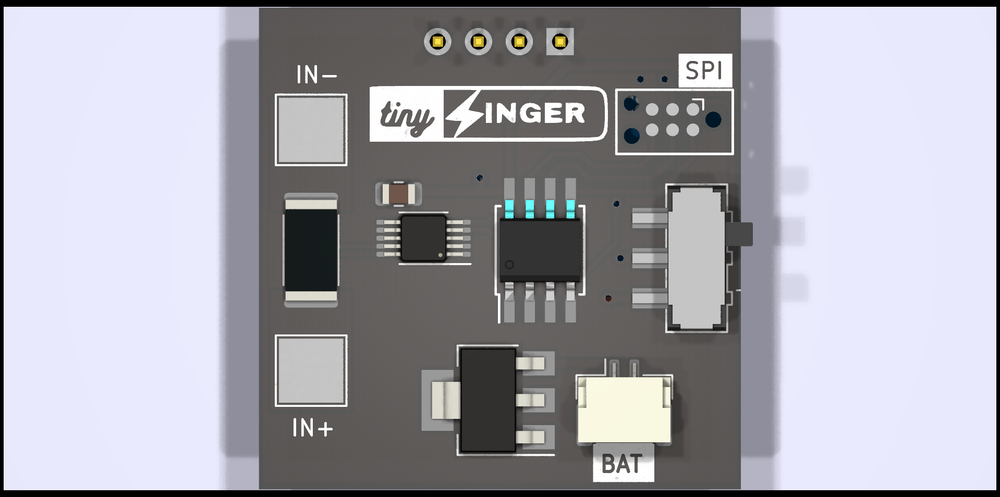
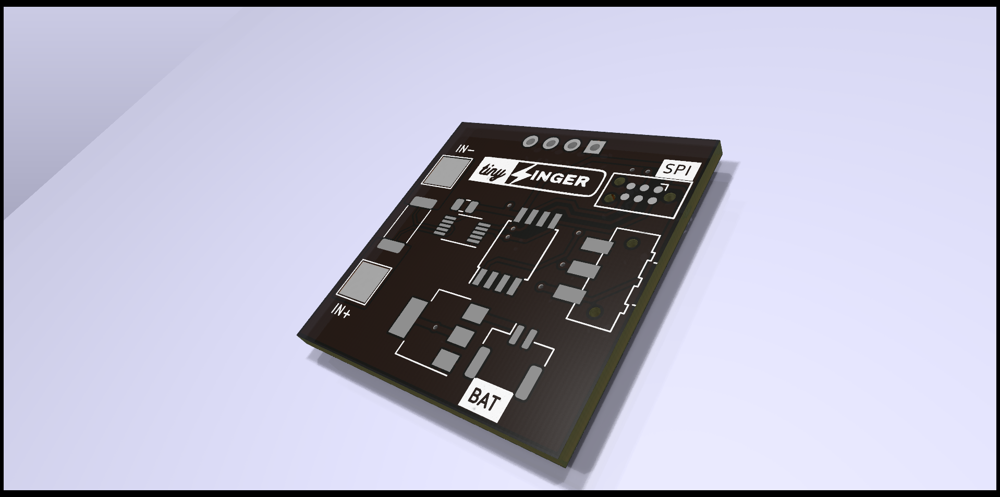
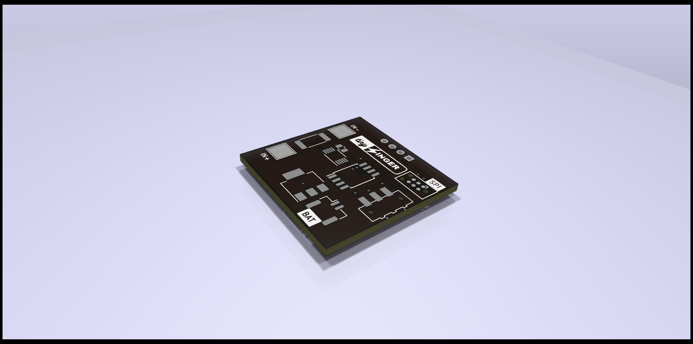
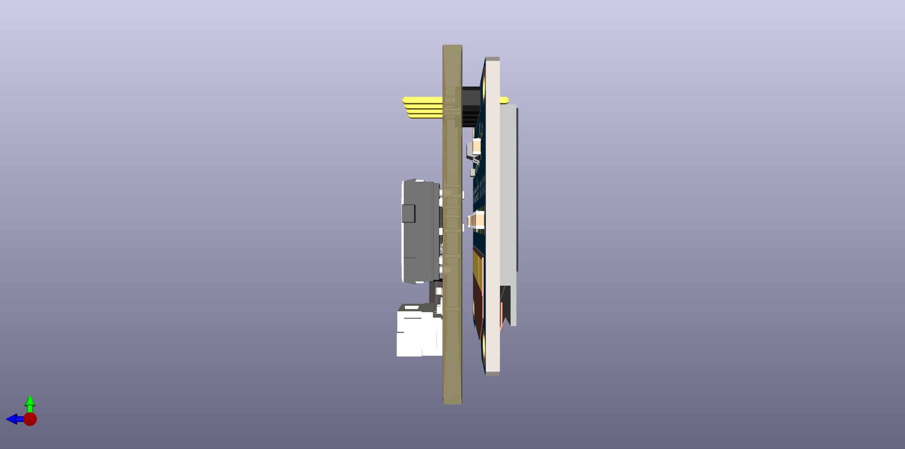

# FancyDMM

Inspired by the Atmega328P-based voltage and current measuring device utilizing the INA266 current sensor, I aim to create a more compact and cost-effective version using the versatile ATTiny microcontroller. 
This project will involve designing a circuit to measure both voltage and current, processing the data using the ATTiny, and displaying the results on an appropriate display.
To keep the code size low, I used Bare Metal coding. 
____
## Photo Gallery

|||
|-----|------|
|||

____
## Project Inspired from

link : <https://hackaday.io/project/191203-mini-oled-panel-meter>
